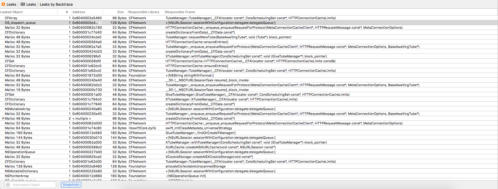
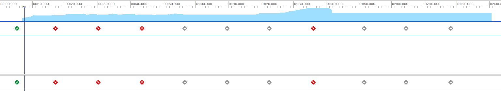
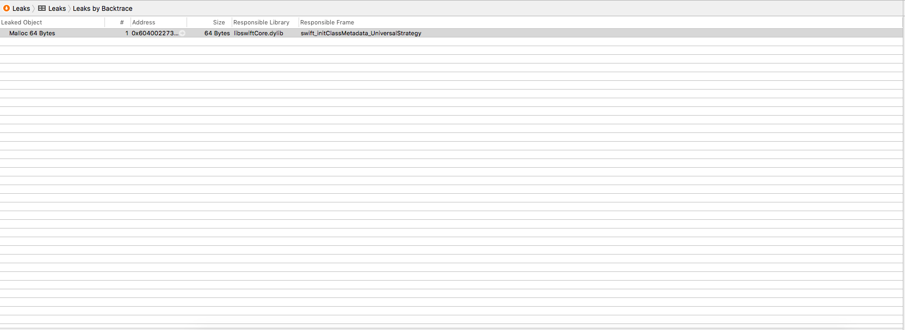
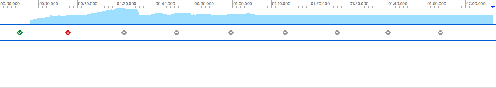
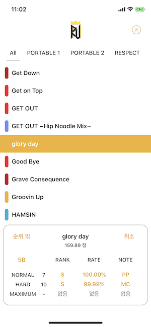

# RespectU_iOS

### RespectU : Guide for DJMAX RESPECT (iOS)

국산 리듬게임 **[디제이맥스 리스펙트](https://www.djmaxrespect.com/#)** 의 가이드 애플리케이션

### 개발 기간

'17.10. ~ 현재

### 사용한 라이브러리

[RealmSwift](https://cocoapods.org/pods/RealmSwift)

[SwiftKeychainWrapper](https://cocoapods.org/pods/SwiftKeychainWrapper)

[SwiftLint](https://cocoapods.org/pods/SwiftLint)

[XLPagerTabStrip](https://cocoapods.org/pods/XLPagerTabStrip)

[GaugeKit](https://cocoapods.org/pods/GaugeKit)

[DZNEmptyDataSet](https://cocoapods.org/pods/DZNEmptyDataSet)

[MarqueeLabel/Swift](https://cocoapods.org/pods/MarqueeLabel)

[~~AKPickerView-Swift~~](https://cocoapods.org/pods/AKPickerView-Swift)

[~~Firebase~~](https://cocoapods.org/pods/Firebase) 

[~~GoogleSignIn~~](https://cocoapods.org/pods/GoogleSignIn) 

### 의의

- 세 번째 개인 프로젝트
- App Store에 업로드한 첫 번째 애플리케이션
  - 참고 부문 iPad 최고 14위, iPhone 최고 90위
  - 다운로드 수 900+ (Android까지 합하여 2500+)
- 사용자들의 다양한 피드백에 대응하며 기능 추가, 버그 수정
- 공부해온 것들을 활용하여 지속적으로 유지보수 중
  - '18.9. 서버 연동
  - '18.7. 리팩토링
  - '18.3. 앱 구조 / 디자인 전면 수정

### 개발 이슈

1. SwiftLint를 통한 코드 스타일 및 컨벤션 강제

   - 수많은, 다양한 에러와 경고가 발생하였다.
   - 수정 과정을 통해서 사람들이 많이 사용하는 코딩 컨벤션 뿐만 아니라 곳곳에 깨알같은 불편한 코드들을 수정할 수 있었다.
   - 또한 델리게이트를 위한 변수는 `weak` 로 선언해야 하는 등 단순히 코딩 컨벤션에 관련되지 않고 실용적으로 쓸 수 있는 방법을 배웠다.
   - **에러**
     - `identifier_name`
       - 최소 세 글자 이상의 변수명을 원했고, 두 글자 변수명엔 경고, 한 글자 변수명엔 에러를 내었다.
       - 프로젝트 특성상 두 글자 이하의 변수명을 사용해도 이상하지 않은 것들이 여럿 있으므로, `identifier_name` 규칙에 대해 몇 가지 경우를 제외시키는 방향으로 진행하였다.
     - `type_name`
       - 중첩 타입으로 정의한 열거형의 이름을 소문자로 적었다... 대문자로 고쳐주었다.
       - 또한 타입 이름도 변수명처럼 최소 세 글자 이상을 권장한다. `identifier_name` 규칙에서 한 것처럼 특정 타입명의 경우는 제외시켰다.
       - 타입명은 대문자 캐멀케이스를 사용한다.
     - `force_try`
       - `try! Realm()` 같은 `try!` 를 사용해도 괜찮은 부분에서만 사용하였으므로 규칙에서 제외시켰다.
     - `function_body_length`
       - 에러로도 뜨고, 경고로도 떴다. 최종적으로 함수를 분리시키는 방안을 생각해 보기로 했다.
   - **경고**
     - `leading_whitespace` / `trailing_whitespace` / `line_length`
       - 제외시킨 규칙들. 코드 블록들이 너무 다닥다닥 붙어있는 것은 별로인 것 같다. 나중에 프로젝트를 진행할 때는 이 빈 줄에 주석을 사용하여 코드 블록에 대한 간단한 설명을 덧붙이는 방법을 사용해야겠다.
       - `line_length` 의 경우 프레임워크에 포함된 메소드를 사용할 때 더 많이 발생했으므로 제외시켰다.
     - `for_where` 
       - `for-in` 구문으로 컬렉션을 순회하면서 `if` 문으로 조건을 주어 작업을 처리하고 `break` 하는 코드가 있었는데, 이렇게 하기보다는 `where` 구문을 사용하여 더 나은 코드와 결과를 얻을 수 있었다.
     - `trailing_newline`
       - 보통 파일의 끝에 불필요한 공백이 존재할 때 발생하였다.
     - `cyclomatic_complexity`
       - 탭의 길이를 말하는 것 같다. 기본값이 10이었는데, 나는 탭의 크기가 4이므로 20으로 수정해주었다.
       - 그래도 에러가 났다. 나중에 다시 한번 보기로 하자.
     - `function_parameter_count`
       - 함수의 매개변수 개수는 5개 이하를 권장한다.
       - 그 이상이 될 때는 구조체같은 것을 만들어서 보내주자.
       - 어디서 매개변수 5개 까지는 레지스터에 저장되고 그 이상은 메모리에 저장되어서 속도 차가 난다고 들었던 것 같다. 이것 때문도 있겠지만 구조체 같은 것에 묶어서 보내주는 것이 여러모로 좋다.
     - `opening_brace`
       - 중괄호를 열 때는 공백을 하나 주고 열자. 일부 깨알같은 불편한 코드에서 발생하였다.
     - `control_statement`
       - if / for / guard / switch / while / catch 등의 조건을 괄호로 묶을 필요가 없다.
       - 작년에 작성한 코드 중 미처 확인하지 못한 코드가 이렇게 되어 있었고 수정해 주었다.
     - `void_return`
       - `Void` 를 리턴하는 함수라면 `-> ()` 대신 `-> Void` 라고 작성하자.
     - `unused_closure_parameter`
       - 사용하지 않는 클로저 파라미터는 `_` 로 처리해주자.
     - `notification_center_detachment`
       - `deinit` 에서 옵저버를 제거하는 코드를 작성하자.
       - 내 프로젝트에서는 이 규칙이 적합하지 않았는데, 프로젝트 구성상 문제가 있는 부분이라 이 규칙을 바로 준수하게 하는 것은 어려울 것 같다.
     - `nesting`
       - 응답 모델을 정의하는 곳에서 발생하였다. 중첩 타입의 뎁스를 두 개 이상으로 하는 것을 지양하자.
     - `comma`
       - 콤마 뒤에 공백을 두 개 줬었다.
     - `weak_delegate`
       - 델리게이트 변수는 참조 순환을 피하기 위해 `weak` 로 선언되어야 한다.
     - `class_delegate_protocol` 
       - 델리게이트를 위한 프로토콜을 클래스만 채택할 수 있게 해야 한다. 그래야 약한 참조가 가능하다.
       - `weak_delegate` 와 함께 실용적인 팁을 얻은 부분이다.
     - `mark`
       - 마크 주석 관련. `// MARK: ` 또는 `// MARK: -` 과 같은 형식을 사용한다.
     - `multiple_closure_with_trailing_closure`
       - 한 개 이상의 클로저를 파라미터로 넘길 때 후행 클로저 문법 사용을 지양하자.
     - `colon`
       - 콜론 뒤에 공백을 두 개 줬었다.
     - `unneeded_break_in_switch`
       - switch 문에서 불필요한 `break` 를 제거하여 해결하였다.
     - `type_body_length`
       - 타입의 구현부는 기본 200줄 이하로 하자.
     - `file_length`
       - 한 파일의 소스 코드 라인 수는 기본 400줄 이하로 하자.

2. Memory Profiling

   - [메모리 관리](https://www.appcoda.com/memory-management-swift/?utm_source=drip&utm_medium=email&utm_campaign=design-pattern-memory-management)에 관한 글을 읽던 중 메모리 누수 프로파일링 툴을 소개하는 문장이 있었고, 이를 통해 메모리 누수 현황을 살필 수 있었음

   - `CFNetwork` 클래스에서 많은 누수가 일어났고, `URLSession` 을 사용하여 네트워킹을 하는 세션을 명시적으로 종료해주지 않아서 일어난 것이라는 것을 알게 됨

   - `finishTasksAndInvalidate` 메소드를 통해 세션을 명시적으로 종료해 주었고, 초반 메모리 사용량을 약 5MB 감소시킴

   - 이외에 메모리 누수가 일어나는 부분을 알게 되었음

   - 프로파일링 과정
     - 앱 실행 (닉네임 / 버전 받아오는 네트워킹 수행) -> `GuideViewController` 로드 -> `SongViewController` 로드(모든 탭 로드) -> `MissionViewController` 로드 ->  `TrophyViewController` 로드 -> `AchievementViewController` 로드 -> `DownloadViewController` 로드(성과 정보 받아오는 네트워킹 수행)
     - 프로파일링 전 메모리 상태
       - 시작 : 18.83MB ~ 22MB
       - 최고 : 51MB (`SongViewController` 의 모든 탭을 로드했을 때)
       - 끝 : 31.79MB

     

     

     - 프로파일링 후 메모리 상태
       - 시작 : 13.16MB ~ 24MB
       - 최고 : 43MB (`SongViewController` 의 모든 탭을 로드했을 때)
       - 끝 : 26.53MB

     

     

3. Realm 모델
   - 서버와의 연동을 위해 데이터베이스 정규화를 진행하였고, 그 과정에서 Realm 모델 정의에 대해 어려움을 겪음
   - `try! Realm()` 에서 에러가 났으나 에러 메세지를 보여주지 않았고, 다른 프로젝트에서 모델을 옮겨서 실행하니 에러 메세지를 보여주어서 이를 참고함
   - Realm 공식 문서를 참고하는 것이 Realm에서 사용할 수 있는 모델을 작성하는 것에 큰 도움을 줌
     - 계산 프로퍼티는 Realm 모델에서 자동적으로 제외됨
     - 계산 프로퍼티는 `sorted()` 나 `filter()` 의 key나 keyPath로 사용할 수 없음
     - `String` , `Date` , `Data` 를 제외한 타입을 옵셔널로 선언하려면 Realm에서 제공하는 타입을 사용해야 함
       - 예를 들어, `Int?` == `RealmOptional<Int>` . `value` 프로퍼티를 사용하여 값에 접근함, `let` 키워드를 사용하여 선언해야 함
     - **중첩 타입을 지원하지 않음**

4. 서버 데이터베이스와 로컬 데이터베이스(Realm)와의 동기화
   - Firebase를 통해 하고 있는 인증 / 데이터베이스 기능을 Node.js로 작성한 서버로 이전
   - 서버에서 데이터를 가져와 로컬 데이터베이스에 저장하여 앱 내에서 사용하고, 백업 느낌으로 서버로 데이터를 내보내는 기능을 구현
   - 클라이언트 단에서 수정해야 하는 코드가 매우 많았는데, 특히 모델을 변경했기 때문에 많은 코드를 수정해야 했다.

5. 리팩토링
   - MVC 아키텍쳐 적용
   - Swift API Guideline에 맞는 코딩 스타일
   - OOP, 함수를 활용한 중복 코드 제거, 코드 응집력 증가

6. XLPagerTapStrip을 사용한 View Controller 위에 View 올리기

   - View Controller의 Life Cycle에 대해 다시 한번 공부함

7. 메모리 사용량, 애플리케이션 용량
   - 기존에 gif 파일을 로컬에 때려박아 사용하여 최대 400MB의 메모리를 차지함
     - gif 파일을 아예 없애서 현재 20MB 안팎의 메모리를 차지하고 있음
   - 기존에 이미지를 Asset에 저장해두고 사용
     - 서버 연동 이후에는 데이터 초기화 시 이미지를 URL을 통해 다운로드하여 Documents 디렉토리에 이미지를 저장

8. L10n
   - 기본 영어, 한국어 / 일본어 / 중국어 지원
   - 현재 영어, 한국어만 지원

9. Realm Migration
   - Realm Object의 형태를 바꾸면 Migration이 필요함
   - 구글링 통해 해결

### 버전 기록

**3.00**

- DJMAX RESPECT 1.18에 대응
- UI 전면 수정

---

**2.12**

- 기록한 성과 정보를 서버에 업로드하는 기능 추가
- 업로드한 성과 정보를 내려받아 내부 데이터베이스에 갱신하는 기능 추가 (백업)
- 랭킹 기능 추가

**2.11**

- 조건별 성과 검색 기능 추가

**2.10** 

- DJMAX RESPECT 1.17에 대응
- 전체적인 데이터 구조 변경

**2.09**

- 버그 수정

**2.08**

- DJMAX RESPECT 1.16에 대응

**2.07**

- BLACK SQUARE DLC 미션 보상 정보 업데이트

**2.06**

- DJMAX RESPECT 1.14에 대응
- 성능 개선

**2.05**

- 누락된 미션 이펙터 추가

**2.04**

- 성과 기록 편의성 개선

**2.03**

- DJMAX RESPECT 1.13 대응

**2.02**

- DJMAX RESPECT 1.12 대응
- 조건별 성과 검색 기능 추가

**2.01**

- 성과 기록 편의성 개선

**2.00**

- 앱의 방향성을 전환하기 위한 앱의 전체적인 구조, 디자인 변경

---

**1.25**

- DJMAX RESPECT 1.11 대응
- TIP 수정

**1.24**

- 버그 수정

**1.23**

- 스킬 포인트 계산기 추가
- 스킬 레벨 UI 수정

**1.22**

- 랭킹 시스템
- TOP 50 화면에서 성과 기록 가능
- 앱 아이콘 변경

**1.21**

- TOP 50 표시 정보 추가
- 버그 수정

**1.20**

- TOP 50 기능
- 트로피 이미지 표시
- 버그 수정

**1.19**

- 스킬 레벨 산출법 수정
- 정렬 시 섹션 인덱스 표시
- 성과 기록 편의성 개선

**1.18**

- 잘못된 데이터베이스 수정
- 스킬 레벨 시스템
- 버그 수정

**1.17**

- 초보자 팁 추가

**1.16**

- CLAZZIQUAI EDITION 미션 클리어 보상 정보 추가

**1.15**

- CLAZZIQUAI EDITION DLC 관련 정보 추가
- 음악 랜덤 선택 기능
- 주 버튼 설정 기능
- 정확도 계산기 기능
- 버그 수정

**1.14**

- 음악 화면에서 MAX COMBO / PERFECT PLAY 확인 가능
- 미션 화면에서 미션 보상 정보 확인 가능
- 버그 수정

**1.13**

- 플레이리스트 화면에서의 정렬 기능
- 버그 수정

**1.12**

- Trilogy DLC 트로피 정보의 일본어 대응
- 음악 화면에서 미션 클리어로 해금 가능한 음악 정보 확인 가능
- 버그 수정

**1.11**

- 버그 수정

**1.10**

- 도전 과제 추가
- 음악 화면에서 도전 과제로 해금 가능한 음악 정보 확인 가능

**1.09**

- Guilty Gear DLC에 대응

**1.08**

- 성과 기록 편의성 개선

**1.07**

- 야간 모드
- 성과 기록과 요약 기능

**1.06**

- 로컬라이징

**1.05**

- 플레이리스트 기능 추가

**1.04**

- 섹션 인덱스를 통한 빠른 탐색
- 미션 화면의 UI 개선

**1.03**

- UI / UX 개선
- 변속 음악에 대한 추천 배속 기능

**1.02**

- 미션 보상, 트로피 정보 추가

**1.01**

- 추천 배속 기능

**1.00**

- 배포

