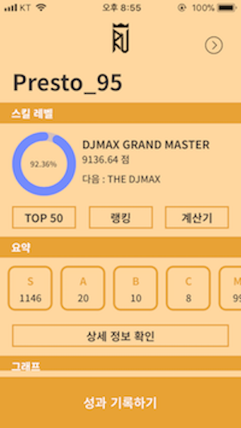
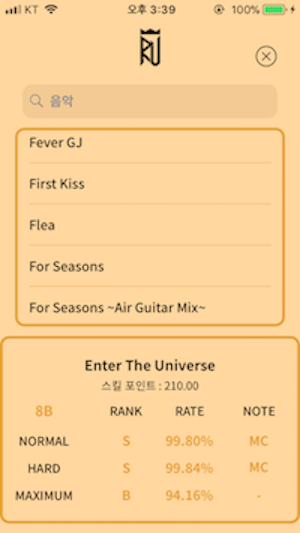
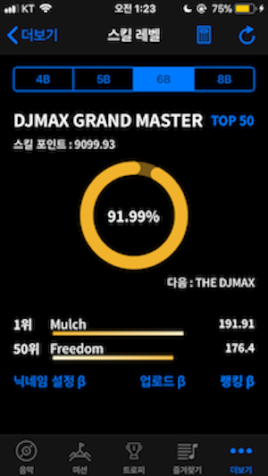

# RespectU_iOS

### RespectU : Guide for DJMAX RESPECT (iOS)

국산 리듬게임 **[디제이맥스 리스펙트](https://www.djmaxrespect.com/#)** 의 가이드 애플리케이션

### 개발 기간

'17.10. ~ 현재

### 사용한 라이브러리

[Realm](https://cocoapods.org/pods/RealmSwift)

[SwiftKeychainWrapper](https://cocoapods.org/pods/SwiftKeychainWrapper)

[CryptoSwift](https://cocoapods.org/pods/CryptoSwift)

[XLPagerTabStrip](https://cocoapods.org/pods/XLPagerTabStrip)

[GaugeKit](https://cocoapods.org/pods/GaugeKit)

[DZNEmptyDataSet](https://cocoapods.org/pods/DZNEmptyDataSet)

[AKPickerView-Swift](https://cocoapods.org/pods/AKPickerView-Swift)

[MarqueeLabel/Swift](https://cocoapods.org/pods/MarqueeLabel)

[~~Firebase~~](https://cocoapods.org/pods/Firebase) 

[~~GoogleSignIn~~](https://cocoapods.org/pods/GoogleSignIn) 

### 의의

- 세 번째 개인 프로젝트
- App Store에 업로드한 첫 번째 애플리케이션
  - 참고 부문 iPad 최고 14위, iPhone 최고 90위 달성
  - 다운로드 수 900+ (Android까지 합하여 2500+)
- 사용자들의 다양한 피드백에 대응하며 기능 추가, 버그 수정
- 공부해온 것들을 활용하여 지속적으로 유지보수 중
  - '18.8. 서버 연동
  - '18.7. 리팩토링
  - '18.3. 앱 구조 / 디자인 전면 수정

### 개발 이슈

1. Realm 모델
   - 서버와의 연동을 위해 데이터베이스 정규화를 진행하였고, 그 과정에서 Realm 모델 정의에 대해 어려움을 겪음
   - `try! Realm()` 에서 에러가 났으나 에러 메세지를 보여주지 않았고, 다른 프로젝트에서 모델을 옮겨서 실행하니 에러 메세지를 보여주어서 이를 참고함
   - Realm 공식 문서를 참고하는 것이 Realm에서 사용할 수 있는 모델을 작성하는 것에 큰 도움을 줌
     - 계산 프로퍼티는 Realm 모델에서 자동적으로 제외됨
     - 계산 프로퍼티는 `sorted()` 나 `filter()` 의 key나 keyPath로 사용할 수 없음
     - `String` , `Date` , `Data` 를 제외한 타입을 옵셔널로 선언하려면 Realm에서 제공하는 타입을 사용해야 함
       - 예를 들어, `Int?` == `RealmOptional<Int>` . `value` 프로퍼티를 사용하여 값에 접근함, `let` 키워드를 사용하여 선언해야 함
     - **중첩 타입을 지원하지 않음**
2. 서버 데이터베이스와 로컬 데이터베이스(Realm)와의 동기화
   - Firebase를 통해 하고 있는 인증 / 데이터베이스 기능을 Node.js로 작성한 서버로 이전
   - 서버에서 데이터를 가져와 로컬 데이터베이스에 저장하여 앱 내에서 사용하고, 백업 느낌으로 서버로 데이터를 내보내는 기능을 구현하려고 함
   - 클라이언트 단에서 수정해야 하는 코드가 매우 많음
3. 리팩토링
   - MVC 아키텍쳐 적용
   - Swift API Guideline에 맞는 코딩 스타일
   - OOP, 함수를 활용한 중복 코드 제거, 코드 응집력 증가
4. XLPagerTapStrip을 사용한 View Controller 위에 View 올리기
   - View Controller의 Life Cycle에 대해 다시 한번 공부함
5. 메모리 사용량, 애플리케이션 용량
   - gif 파일을 로컬에 때려박으면 안된다.
   - 로컬에서 이미지를 사용해야 한다면, 크기를 최소화하는 것이 좋다.
6. i18n
   - 기본 영어, 한국어 / 일본어 / 중국어 지원
   - 현재 영어, 한국어만 지원
7. Realm Migration
   - Realm Object의 형태를 바꾸면 Migration이 필요함
   - 구글링 통해 해결

### 버전 기록

**현재** 

- Firebase를 통한 인증, 데이터베이스 등의 기능을 Node.js로 작성한 서버로 이전하는 중

**2.09**

- 버그 수정

**2.08**

- DJMAX RESPECT 1.16에 대응

**2.07**

- BLACK SQUARE DLC 미션 보상 정보 업데이트

**2.06**

- DJMAX RESPECT 1.14에 대응
- 성능 개선

**2.05**

- 누락된 미션 이펙터 추가

**2.04**

- 성과 기록 편의성 개선

**2.03**

- DJMAX RESPECT 1.13 대응

**2.02**

- DJMAX RESPECT 1.12 대응
- 조건별 성과 검색 기능 추가

**2.01**

- 성과 기록 편의성 개선

**2.00**

- 앱의 방향성을 전환하기 위한 앱의 전체적인 구조, 디자인 변경

---

**1.25**

- DJMAX RESPECT 1.11 대응
- TIP 수정

**1.24**

- 버그 수정

**1.23**

- 스킬 포인트 계산기 추가
- 스킬 레벨 UI 수정

**1.22**

- 랭킹 시스템
- TOP 50 화면에서 성과 기록 가능
- 앱 아이콘 변경

**1.21**

- TOP 50 표시 정보 추가
- 버그 수정

**1.20**

- TOP 50 기능
- 트로피 이미지 표시
- 버그 수정

**1.19**

- 스킬 레벨 산출법 수정
- 정렬 시 섹션 인덱스 표시
- 성과 기록 편의성 개선

**1.18**

- 잘못된 데이터베이스 수정
- 스킬 레벨 시스템
- 버그 수정

**1.17**

- 초보자 팁 추가

**1.16**

- CLAZZIQUAI EDITION 미션 클리어 보상 정보 추가

**1.15**

- CLAZZIQUAI EDITION DLC 관련 정보 추가
- 음악 랜덤 선택 기능
- 주 버튼 설정 기능
- 정확도 계산기 기능
- 버그 수정

**1.14**

- 음악 화면에서 MAX COMBO / PERFECT PLAY 확인 가능
- 미션 화면에서 미션 보상 정보 확인 가능
- 버그 수정

**1.13**

- 플레이리스트 화면에서의 정렬 기능
- 버그 수정

**1.12**

- Trilogy DLC 트로피 정보의 일본어 대응
- 음악 화면에서 미션 클리어로 해금 가능한 음악 정보 확인 가능
- 버그 수정

**1.11**

- 버그 수정

**1.10**

- 도전 과제 추가
- 음악 화면에서 도전 과제로 해금 가능한 음악 정보 확인 가능

**1.09**

- Guilty Gear DLC에 대응

**1.08**

- 성과 기록 편의성 개선

**1.07**

- 야간 모드
- 성과 기록과 요약 기능

**1.06**

- 로컬라이징

**1.05**

- 플레이리스트 기능 추가

**1.04**

- 섹션 인덱스를 통한 빠른 탐색
- 미션 화면의 UI 개선

**1.03**

- UI / UX 개선
- 변속 음악에 대한 추천 배속 기능

**1.02**

- 미션 보상, 트로피 정보 추가

**1.01**

- 추천 배속 기능

**1.00**

- 배포

